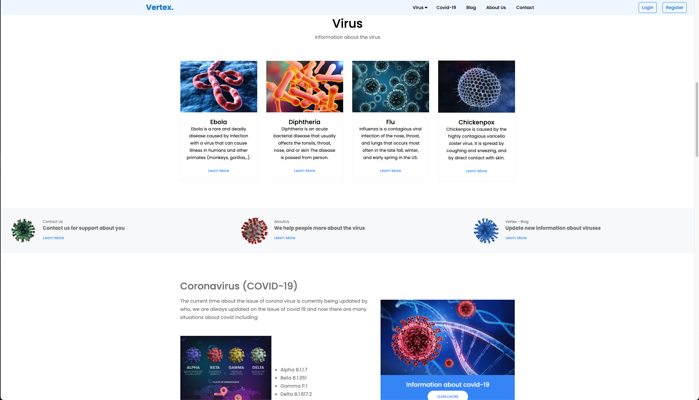

# Ngo Thinh Phat (thinhphat04)
<h1 align="center">
    
</h1>
<h3 align="center">⚒️ Languages-Frameworks-Tools ⚒️</h2> 

    
     
         

<!-- ## GitHub Stats
<!--  --> 

## Social contact with me

## My Project

### Project 1: Vertex (Blog Virus)
•	A blog project with a focus on viruses.

    
    
    
    

---

### Project 2: EasyFly (Booking Airline)
•	An online airline ticket booking system.

    
    
    
    
    

---

### Project 3: Clinic (System Management Clinic)
•	A clinic management system.

    
    
    
    
    
    

---

### Project 4: TechShop (Ecommerce Store)
	•	A blog project with a focus on viruses.

  
   
    
   
  

---